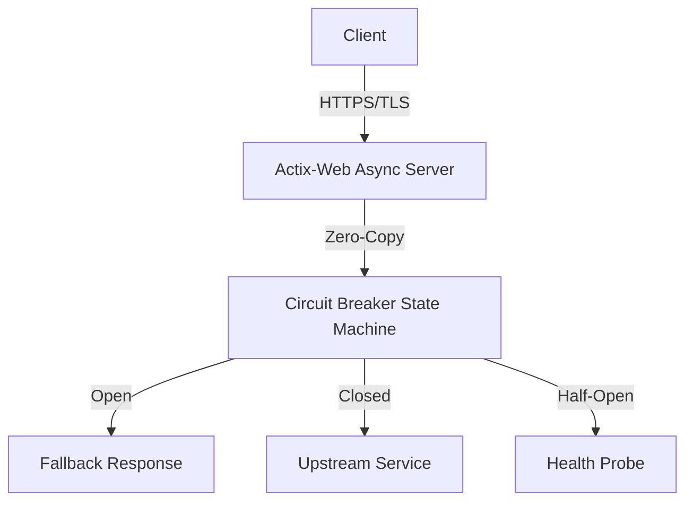

# Rust-Circuit-Breaker


A memory-safe, zero-cost abstraction API Gateway implementing the Circuit Breaker pattern to protect downstream microservices from cascading failures.

## System Architecture





## Elite Features
- **Tokio Async Runtime**: Non-blocking event loop for maximum throughput.
- **Zero-Cost Abstractions**: Rust's ownership model ensuring thread-safe state mutations.
- **Actix-Web**: One of the fastest web frameworks available.

## Quick Start
```bash
cargo check
cargo test
cargo run --release
```
